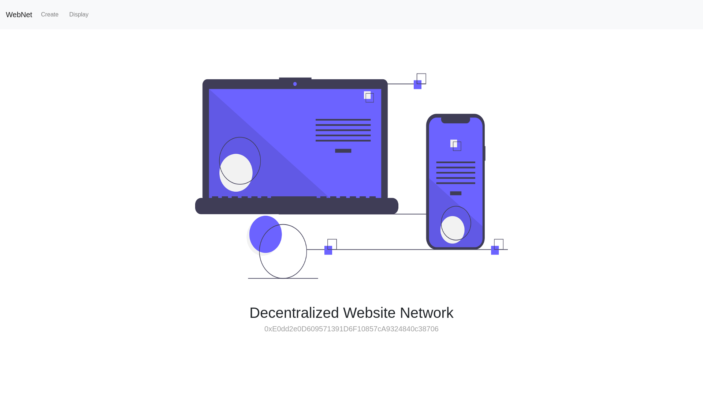

## Decentralized Website Network
> Built to bring out a minimalist decentralized website with an interactive UI just for you.


### Prerequisites
* Following things are required to be already running on your machine for running the local copy
1. Ganache
2. Metamask

### Installing

* A step by step series for how to get the DApp running on your respective local system.

1. git clone the repo

```
git clone https://github.com/AemieJ/webNet.git
```

2. Install all the modules in your directory

```
npm install 
```

3. Run the dependencies to get a local copy of the DApp

```
npm run start
```

### DEMO

* **LANDING PAGE** 




## Built With

* [Truffle](https://www.trufflesuite.com/) - A world class development environment, testing framework and asset pipeline for blockchains using the Ethereum Virtual Machine (EVM), aiming to make life as a developer easier.
* [Ganache](https://www.trufflesuite.com/docs/ganache/overview) - A personal blockchain for Ethereum development 
* [Metamask](https://metamask.io/) - MetaMask is a bridge that allows you to visit the distributed web of tomorrow in your browser today. It allows you to run Ethereum dApps right in your browser without running a full Ethereum node.
* [Web3](https://web3js.readthedocs.io/en/v1.2.4/) - web3.js is a collection of libraries which allow you to interact with a local or remote ethereum node, using a HTTP or IPC connection.
* [ReactJS](https://reactjs.org/) - React is a JavaScript library for building user interfaces.

## Authors

* **Aemie Jariwala** - [AemieJ](https://github.com/AemieJ)
